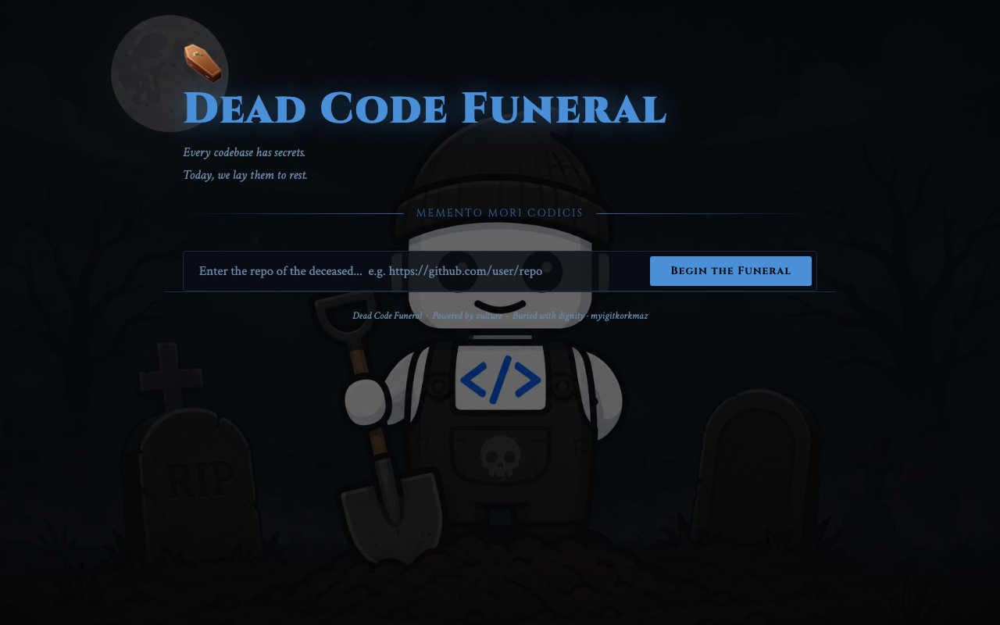

<div align="center">

# ⚰️ Dead Code Funeral

**Every codebase has secrets. Today, we lay them to rest.**

Paste a GitHub repo URL. Dead Code Funeral clones the repo, finds the unused functions, variables, classes and imports, and gives each one a proper eulogy.

*Built for the IBM Bob Hackathon.*




</div>

## How it works

```
frontend/index.html ──POST /analyze {github_url}──▶ Flask (backend/app.py)
                                                     │
                                                     ├─ clone repo into a temp dir (GitPython)
                                                     ├─ scan every .py file (vulture)
                                                     └─ return dead code as JSON, delete the temp dir
                    ◀──────────── results ───────────┘
                    ──POST /eulogize {name, type…}──▶ random eulogy for that item
```

Only **Python** repositories are scanned for now. vulture reports unused functions, classes, variables, attributes and imports.

## Quick start

```bash
git clone https://github.com/myigitkorkmaz/dead-code-funeral.git
cd dead-code-funeral/backend

python3 -m venv .venv && source .venv/bin/activate
pip install -r requirements.txt
python app.py              # serves on http://localhost:5001
```

Then open `frontend/index.html` in your browser. It's a single static file, so there's no build step. The frontend expects the API at `http://localhost:5001`.

## API

| Method | Endpoint | Body | Returns |
| --- | --- | --- | --- |
| `GET` | `/health` | – | `{ status, message }` |
| `POST` | `/analyze` | `{ "github_url": "https://github.com/user/repo" }` | `{ total, results: [{ name, filename, line, type, size }] }` |
| `POST` | `/eulogize` | `{ "name", "type", "filename", "line" }` | `{ eulogy, … }` |

```bash
curl -X POST localhost:5001/analyze \
  -H 'Content-Type: application/json' \
  -d '{"github_url": "https://github.com/pallets/itsdangerous"}'
```

```json
{
  "total": 21,
  "results": [
    { "name": "copyright", "filename": "docs/conf.py", "line": 7, "type": "unused variable", "size": 1 }
  ]
}
```

## Project structure

```
backend/
  app.py            Flask API and eulogy generator
  scanner.py        clone → vulture scan → cleanup
  requirements.txt
frontend/
  index.html        the graveyard UI (vanilla HTML/CSS/JS)
bob_sessions/       IBM Bob session export and screenshots from the hackathon
```

## Limitations

- Only Python files are analyzed.
- vulture uses static analysis, so it can flag code that is only used dynamically (via `getattr`, framework hooks, and so on). Treat the results as suspects, not confirmed dead code.
- Repos are cloned in full on every request, so very large repos will be slow.
